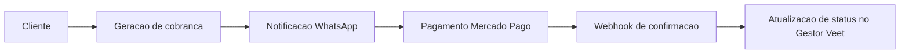

# Gestor Veet

Plataforma de gestao IPTV para operacao comercial, cobranca recorrente e comunicacao automatizada com clientes.

## Visao geral

O Gestor Veet centraliza o ciclo operacional de provedores e revendas IPTV:

- cadastro e ciclo de vida de clientes
- controle de planos e renovacoes
- emissao e acompanhamento de cobrancas
- automacoes de notificacao por WhatsApp
- painel administrativo com perfis e permissoes

## Modulos do projeto

- Clientes: cadastro, importacao/exportacao, cobranca manual e historico
- Planos: CRUD, duplicacao e gestao de renovacoes
- Campanhas: disparos programados com templates e placeholders
- Revendas: controle de revenda e usuarios revendedores
- Pagamentos: fluxo PIX com Mercado Pago e webhook de confirmacao
- Conexoes WhatsApp: integracao com Evolution API (v1 e v2)
- Dashboard: indicadores financeiros e operacionais
- Atualizacoes: rotinas para update de codigo e deploy

## Integracoes

- Mercado Pago
- Evolution API (WhatsApp)
- QPanel (sincronizacao opcional de dados de cliente)
- GitHub (fluxo de update e CI)

## Fluxo operacional



## Stack tecnica

- Backend: Laravel 10 / PHP 8.2
- Auth e seguranca: Fortify, Jetstream, Sanctum
- Frontend: Laravel Mix (Webpack), Bootstrap 5
- Banco de dados: MySQL 8
- Servidor web: Apache 2
- Infra recomendada: Ubuntu 22.04

## Instalacao rapida (Ubuntu 22.04)

Na raiz do projeto:

```bash
bash scripts/install-ubuntu.sh
```

Tudo em uma linha (clone + install):

```bash
bash -lc "git clone https://github.com/wesleiandersonti/gestor-vet.git && cd gestor-vet && bash scripts/install-ubuntu.sh"
```

## Instalador interativo

O instalador executa um fluxo guiado em 8 etapas:

1. Dependencias de sistema
2. Composer e Node.js
3. Apache + PHP 8.2
4. Definicao de acesso (dominio / IP local / IP publico)
5. Configuracao do banco
6. `.env` + dependencias do app
7. build + migrations
8. virtual host Apache + SSL opcional

## Parametros de automacao

Voce pode rodar sem perguntas usando variaveis de ambiente:

- `DB_NAME` (padrao: `gestorvet`)
- `DB_USER` (padrao: `gestorvet`)
- `DB_PASS` (padrao: `gestorvet`)
- `ACCESS_MODE` (`1=dominio`, `2=ip local`, `3=ip publico`)
- `DOMAIN` (obrigatorio se `ACCESS_MODE=1`)
- `INSTALL_SSL` (`s` para instalar SSL sem prompt)
- `CERT_EMAIL` (email para certbot)

Exemplo (IP local, sem prompts):

```bash
ACCESS_MODE=2 DB_NAME=gestorvet DB_USER=gestorvet DB_PASS=gestorvet bash scripts/install-ubuntu.sh
```

## Locks de dependencias

Este repositorio utiliza lockfiles para garantir deploy previsivel:

- `composer.lock`
- `package-lock.json`

Sempre atualize esses arquivos junto com alteracoes de dependencia.

## Configuracao de ambiente

Base de ambiente: `.env.example`

Campos minimos:

```env
APP_NAME=GestorVeet
APP_ENV=local
APP_KEY=
APP_DEBUG=true
APP_URL=http://127.0.0.1

DB_CONNECTION=mysql
DB_HOST=127.0.0.1
DB_PORT=3306
DB_DATABASE=gestorvet
DB_USERNAME=gestorvet
DB_PASSWORD=gestorvet
```

## Operacao em producao

Scheduler (obrigatorio):

```bash
* * * * * cd /caminho/do/projeto && php artisan schedule:run >> /dev/null 2>&1
```

Queue worker (quando aplicavel):

```bash
php artisan queue:work
```

Build e caches:

```bash
npm run prod
php artisan optimize:clear
php artisan config:cache
php artisan route:cache
php artisan view:cache
```

Comandos de negocio uteis:

```bash
php artisan clientes:verificar-vencidos
php artisan campanhas:disparar
```

## Atualizacao do sistema

Atualizacao padrao na VM:

```bash
bash scripts/update-ubuntu.sh
```

Atualizacao com descoberta automatica do diretorio:

```bash
bash scripts/update-gestor.sh
```

Observacao: se `composer.lock` nao existir, o script aplica fallback para `composer update --no-dev`.

## Hardening de producao

- Rotas tecnicas sensiveis usam middleware `technical.guard` em producao
- Em producao, o acesso exige usuario admin autenticado ou token tecnico
- Configure `TECHNICAL_ROUTES_TOKEN` no `.env` para automacoes seguras
- Envie o token em `X-Technical-Token` para chamadas tecnicas sem sessao web

Exemplo:

```bash
curl -H "X-Technical-Token: SEU_TOKEN" "https://seu-dominio/check-update-status"
```

## Queue com Supervisor

Arquivo de referencia: `deploy/supervisor/gestor-veet-worker.conf`

Instalacao rapida na VM:

```bash
APP_DIR=/var/www/gestor-vet bash scripts/install-supervisor-queue.sh
```

## CI

O projeto possui pipeline em `.github/workflows/ci.yml` com:

- setup PHP 8.2
- install composer
- setup Node 18
- build de assets
- validacao basica do Laravel

## Troubleshooting rapido

- Erro `composer: command not found`: instale Composer
- Erro `PHP atual: 8.1`: atualize para PHP 8.2
- Pagina default do Apache: habilite o vhost `gestor-vet.conf` e desabilite `000-default`
- SSL em IP: LetsEncrypt exige dominio valido

## Melhorias recomendadas

- Manter `composer.lock` e `package-lock.json` versionados para deploy previsivel
- Restringir rotas tecnicas sensiveis em producao (update, exec/checks)
- Configurar Supervisor para `queue:work` em ambiente com carga
- Revisar periodicidade e observabilidade dos jobs de cobranca/campanha

## Licenca

Uso interno e proprietario.
