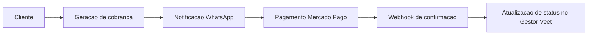

# Gestor Veet

Plataforma de gestao IPTV para operacao comercial, cobranca recorrente e comunicacao automatizada com clientes.

## Proposta

O Gestor Veet foi desenhado para centralizar o ciclo operacional de provedores e revendas:

- cadastro e ciclo de vida de clientes
- controle de planos, renovacoes e vencimentos
- cobranca com fluxo de pagamento
- notificacoes automatizadas por WhatsApp
- painel administrativo com perfis e permissao

## Modulos principais

- Clientes: cadastro, importacao/exportacao e historico
- Planos: CRUD, duplicacao e renovacao
- Campanhas: disparos com template e placeholders
- Revendas: gestao de revendedores e usuarios
- Pagamentos: Mercado Pago com webhook de confirmacao
- Conexoes WhatsApp: Evolution API (v1 e v2)
- Dashboard: indicadores operacionais e financeiros

## Integracoes

- Mercado Pago
- Evolution API
- QPanel (sincronizacao opcional)
- GitHub (CI e fluxo de atualizacao)

## Documentacao tecnica

- Estrutura do projeto: `docs/ESTRUTURA.md`

## Fluxo de negocio



## Stack tecnica

- Laravel 10 / PHP 8.2
- ionCube Loader ativo no PHP CLI e Apache
- Fortify, Jetstream, Sanctum
- Laravel Mix (Webpack), Bootstrap 5
- Node.js 20 LTS
- MySQL 8
- Apache 2
- Ubuntu 22.04 (recomendado)

## Instalacao em VM limpa (comando unico)

Execute como `root` em Ubuntu 22.04:

```bash
bash -lc 'set -euo pipefail; sudo apt-get update && sudo apt-get install -y git && rm -rf /root/gestor-vet && git clone --depth 1 https://github.com/wesleiandersonti/gestor-vet.git /root/gestor-vet && cd /root/gestor-vet && ACCESS_MODE=2 DB_NAME=gestorvet DB_USER=gestorvet DB_PASS=gestorvet bash scripts/install-ubuntu.sh'
```

## Instalacao local (projeto ja clonado)

```bash
bash scripts/install-ubuntu.sh
```

O instalador roda em fluxo guiado (8 etapas): dependencias, PHP/Node, banco, `.env`, build, migrations e Apache.

## Parametros do instalador

- `DB_NAME` (padrao: `gestorvet`)
- `DB_USER` (padrao: `gestorvet`)
- `DB_PASS` (padrao: `gestorvet`)
- `ACCESS_MODE` (`1=dominio`, `2=ip local`, `3=ip publico`)
- `DOMAIN` (obrigatorio quando `ACCESS_MODE=1`)
- `INSTALL_SSL` (`s` para instalar SSL sem pergunta)
- `CERT_EMAIL` (opcional para certbot)

Exemplo sem prompts:

```bash
ACCESS_MODE=2 DB_NAME=gestorvet DB_USER=gestorvet DB_PASS=gestorvet bash scripts/install-ubuntu.sh
```

## Atualizacao do sistema

Atualizacao padrao:

```bash
bash scripts/update-ubuntu.sh
```

Atualizacao com descoberta automatica do diretorio:

```bash
bash scripts/update-gestor.sh
```

## Confiabilidade de deploy

Este repositorio usa lockfiles para garantir previsibilidade:

- `composer.lock`
- `package-lock.json`

Sempre versione lockfiles junto com qualquer alteracao de dependencia.

## Seguranca operacional

Rotas tecnicas sensiveis sao protegidas em producao por `technical.guard`.

- permite acesso com usuario admin autenticado
- ou token tecnico em `X-Technical-Token`
- configure `TECHNICAL_ROUTES_TOKEN` no `.env`

Exemplo:

```bash
curl -H "X-Technical-Token: SEU_TOKEN" "https://seu-dominio/check-update-status"
```

## Queue com Supervisor

Arquivo de referencia:

- `deploy/supervisor/gestor-veet-worker.conf`

Instalacao rapida:

```bash
APP_DIR=/var/www/gestor-vet bash scripts/install-supervisor-queue.sh
```

## Operacao em producao

Scheduler (obrigatorio):

```bash
* * * * * cd /caminho/do/projeto && php artisan schedule:run >> /dev/null 2>&1
```

Build e caches:

```bash
npm run prod
php artisan optimize:clear
php artisan config:cache
php artisan route:cache
php artisan view:cache
```

Comandos de negocio:

```bash
php artisan clientes:verificar-vencidos
php artisan campanhas:disparar
```

## Ambiente

Use `.env.example` como base minima de configuracao.

## CI

Pipeline em `.github/workflows/ci.yml`:

- setup PHP 8.2
- install composer
- setup Node 18
- build de assets
- validacao basica do Laravel

## Troubleshooting rapido

- `composer: command not found`: instale Composer
- `PHP atual: 8.1`: atualize a VM para PHP 8.2
- `post-autoload-dump error 199`: instale/ative `php8.2-ioncube-loader` no CLI
- sem pacote ionCube no apt: o instalador faz fallback automatico por download oficial
- sem rota para `downloads.ioncube.com`: envie o tar.gz para a VM e use `IONCUBE_TARBALL=/caminho/ioncube.tar.gz`
- `Table gestorvet.users doesn't exist` durante install: atualize para a ultima `main` e rode `php artisan migrate --force`
- Node antigo (12/18): o instalador atualiza automaticamente para Node 20
- erro no build SCSS do SweetAlert2 (`Undefined operation var(--swal2-width) * 0.5`): atualize para a ultima `main`
- erro de minificacao em `cards-analytics.js`: atualize para a ultima `main` (build via Babel habilitado)
- pagina default Apache: habilite `gestor-vet.conf` e desabilite `000-default`
- SSL em IP: LetsEncrypt exige dominio valido

## Licenca

Uso interno e proprietario.
